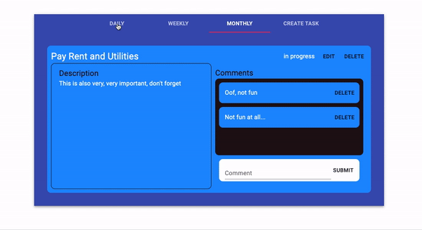
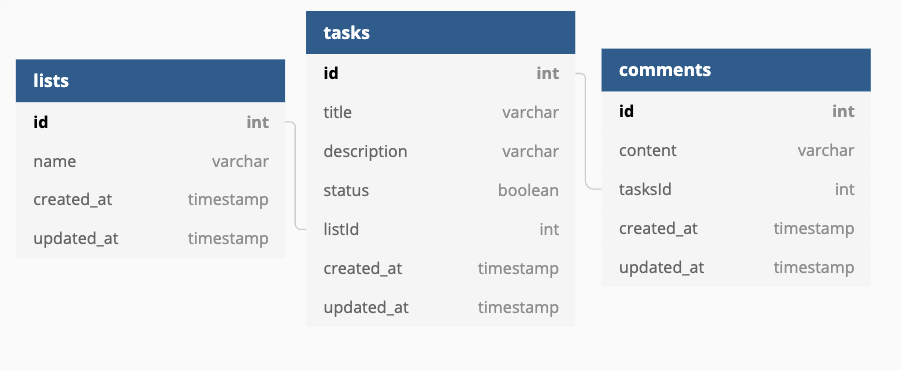

# Trustero Tasks
> Trustero Tasks is a fullstack React App with a Postgres database created by me, Maximos Salzman. I implemented a Flask server on the backend with FlaskSQLAlchemy, and WTFforms. The backend API follows RESTful principles to allow the client to create, edit and delete tasks and comments. 



## Getting started

1. Clone this repository (only this branch)

   

2. Install dependencies

      ```bash
      pipenv install --dev -r dev-requirements.txt && pipenv install -r requirements.txt
      ```

3. Create a **.env** file based on the example with proper settings for your
   development environment
   
4. Setup your PostgreSQL user, password and database and make sure it matches your **.env** file

5. Get into your pipenv, migrate your database, seed your database, and run your flask app

   ```bash
   pipenv shell
   ```

   ```bash
   flask db upgrade
   ```

   ```bash
   flask seed all
   ```

   ```bash
   flask run
   ```

6. To run the React App in development, checkout the [README](./react-app/README.md) inside the `react-app` directory.

